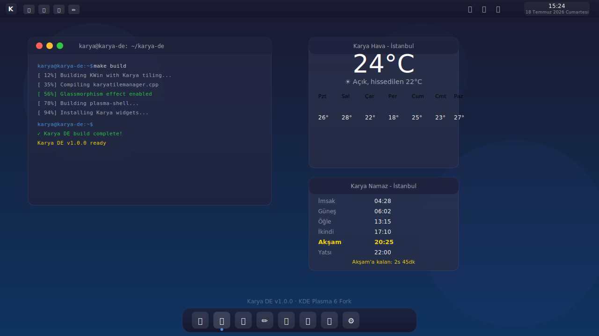

<picture>
  <source media="(prefers-color-scheme: dark)" srcset="branding/logo/karya-logo.svg">
  
</picture>

# Karya DE


**Modern, Türk yapımı masaüstü ortamı.** KDE Plasma 6 tabanlı, tam fork.

Karya DE, KDE Plasma 6'yı tamamen fork'layarak oluşturulmuş, Türk kullanıcılar için özel olarak tasarlanmış bir masaüstü ortamıdır. Modern görünüm, yüksek performans, tam Türkçe desteği ve **NVIDIA/AMD/Intel** otomatik donanım desteği sunar.

---

## Görünüm

> Ekran görüntüleri ilk kararlı build sonrası eklenecek. Aşağıdaki konsept tasarımdır.

<picture>
  <source media="(prefers-color-scheme: dark)" srcset="branding/mockup/karya-mockup-dark.svg">
  
</picture>

---

## Özellikler

### Donanim Destegi
- **NVIDIA** - Proprietary driver otomatik kurulum, Optimus laptop destegi, EGLStreams yapilandirmasi
- **AMD** - AMDGPU acik kaynak driver, RADV Vulkan, ROCm hazirlik
- **Intel** - i915 modul ayarlari, GUC/PSR/FBC optimizasyonlari
- **Otomatik Algilama** - GPU, ses, ag, bluetooth, laptop/VM tespiti
- **Performans Profili** - RAM/GPU'ya gore otomatik kompozitor ayari

### KWin Fork (kwin-karya)
- **Auto Tiling** - 4 layout: Master-Stack, Split, Grid, Monocle
- **Glassmorphism** - Cam efekti (C++ efekti + JS script)
- **Gesture Deste**i** - Trackpad/dokunmatik ekran hareketleri
- **NVIDIA Uyumluluk Modu** - EGLStreams, NO_AMS ayarlari
- **Kisayollar:** Meta+T tiling ac/kapa, Meta+Shift+T layout degistir, Meta+Shift+G glassmorphism toggle

### Plasma Shell Fork
- **Ust panel** - Kickoff, icon tasks, system tray, saat (Turkiye saati, TR gun adlari)
- **Alt dock** - Otomatik gizlenen, ortalanmis uygulama dock'u
- **Tam Turkce** - Tum arayuz, menuler, mesajlar Turkce
- **4 Layout** - Modern, Classic, macOS Style, Minimal (hardware-aware)

### Turk Widget'lar (SVG icon, emoji yok)
| Widget | Aciklama |
|--------|----------|
| **Karya Hava** | 16 sehir, 7 gunluk tahmin, saatlik grafik, nem/ruzgar |
| **Karya Namaz** | Diyanet bazli 6 vakit, kalan sure, aktif vakit vurgusu |
| **Karya Haber** | Kategori filtreli (Gundem/Ekonomi/Teknoloji/Spor/Bilim), kaynak gosterimi |
| **Karya Sistem** | CPU, RAM, Disk, Network monitöru, anlik grafikler |

### OOBE (Kurulum Sihirbazi)
PyQt6 tabanli, donanim algilamali kurulum asistani:
1. **Hos Geldiniz** - Algilanan donanim ozeti (CPU, RAM, GPU, network)
2. **GPU Surucusu** - NVIDIA/AMD/Intel otomatik tani + surucu secimi
3. **Masaustu Duzeni** - RAM'e gore onerilen layout
4. **Bilesenler** - Tiling/Glassmorphism/Blur - dusuk sistemde otomatik kapatma
5. **Kullanici** - Kullanici olusturma, otomatik giris
6. **Ozet** - Tum secimlerin listesi
7. **Kurulum** - Adim adim ilerleme cubugu + log

### SDDM Giris Ekrani
- Ozel Karya temasi, glassmorphism login karti
- Kullanici adi + sifre, oturum secimi (Wayland/X11)
- Kapatma/Yeniden baslatma butonlari
- Turkce arayuz

### Performans & Sistem
- **Wayland + X11** destegi (Wayland onerilen)
- **elogind + runit** ile systemd'siz calisabilme
- **GPU bazli kompozitor** - NVIDIA'da EGLStreams, AMD'de OpenGL, VM'de XRender
- **F2FS/XFS** dosya sistemi onerisi
- Otomatik profil: <4GB=lightweight, 4-8GB=balanced, >8GB=performance

---

## Mimari

```
karya-de/
├── sources/                    # Fork'lanmis KDE repolari
│   ├── kwin/                   # KWin window manager
│   ├── plasma-workspace/       # Panel, shell, bildirimler
│   ├── plasma-desktop/         # Masaustu uygulamalari
│   ├── plasma-pa/              # Ses yonetimi
│   └── systemsettings/         # Ayarlar
├── patches/                    # Karya patch'leri
│   └── kwin/                   # Tiling patch'i
├── kwin-effects/               # Custom KWin efektleri
│   ├── karya-glassmorphism/    # C++ glassmorphism efekti
│   └── scripts/                # KWin JS script'leri
├── shell/                      # Plasma yapilandirmasi
│   ├── layouts/                # Panel/dock layout'lari
│   ├── look-and-feel/          # Tema paketi
│   ├── sessions/               # Oturum dosyalari
│   └── sddm-theme/             # Karya SDDM giris temasi
├── widgets/                    # Plasma 6 widget'lari (SVG icon)
│   ├── karya-hava/             # Hava durumu - 16 sehir
│   ├── karya-namaz/            # Namaz vakitleri - 6 vakit
│   ├── karya-haber/            # Haber basliklari - kategorik
│   └── karya-sistem/           # Sistem monitor - CPU/RAM/Disk/Network
├── hardware/                   # Donanim destegi
│   ├── scripts/                # detect-hardware.sh, install-drivers.sh
│   ├── profiles/               # nvidia.conf, amd.conf, intel.conf
│   └── gpu/audio/network/      # JSON yapilandirma
├── branding/                   # Gorsel kimlik
│   ├── logo/                   # SVG logo
│   ├── icons/karya-icons/      # Ozel SVG icon seti
│   ├── splash/                 # Acilis ekrani
│   ├── mockup/                 # Konsept goruntu
│   └── wallpapers/             # Duvar kagitlari
├── packages/                   # Arch PKGBUILD'lari
│   ├── karya-de-meta/          # Ana meta paket
│   ├── kwin-karya/             # Fork'lanmis KWin
│   ├── karya-widgets/          # Widget paketi (4 widget)
│   ├── karya-oobe/             # Kurulum sihirbazi
│   ├── karya-drivers/          # Surucu destek paketi
│   └── karya-icons/            # Icon temasi
├── calamares/                  # Calamares installer modulleri
├── iso/                        # Arch ISO konfigurasyonu
└── scripts/                    # Derleme araclari
```

---

## Kurulum

### Gereksinimler
- **Arch Linux** (gelistirme icin)
- 4+ GB RAM (2 GB minimal)
- 10+ GB bos disk
- Git, base-devel
- NVIDIA, AMD veya Intel GPU

### Hizli Kurulum (PKGBUILD)

```bash
git clone https://github.com/muhammetodosks/karya-de.git
cd karya-de

# Surucu destegi
cd packages/karya-drivers && makepkg -si && cd ../..

# Icons
cd packages/karya-icons && makepkg -si && cd ../..

# Widgets
cd packages/karya-widgets && makepkg -si && cd ../..

# OOBE
cd packages/karya-oobe && makepkg -si && cd ../..

# Ana paket
cd packages/karya-de-meta && makepkg -si && cd ../..
```

### Kaynak Koddan Derleme

```bash
# 1. Gelistirme ortamini kur
make setup

# 2. Build et (kwin -> workspace -> desktop -> systemsettings)
make build

# 3. Sisteme kur
make install
```

### ISO Olustur

```bash
make iso
# ISO: iso/releng/out/karya-de-1.0.0-x86_64.iso
```

### NVIDIA GPU Kullanicilari Icin

```bash
# OOBE sirasinda NVIDIA surucusu otomatik algilanir
# Manuel kurulum:
sudo pacman -S nvidia nvidia-utils nvidia-dkms nvidia-settings
sudo bash /usr/lib/karya/scripts/install-drivers.sh nvidia

# Optimus laptop icin:
sudo pacman -S nvidia-prime optimus-manager
```

### AMD GPU Kullanicilari Icin

```bash
# OOBE sirasinda otomatik algilanir
# Manuel:
sudo bash /usr/lib/karya/scripts/install-drivers.sh amd
```

### Intel GPU Kullanicilari Icin

```bash
sudo bash /usr/lib/karya/scripts/install-drivers.sh intel
```

---

## Kullanim

### Oturum Baslatma

**SDDM ile (onerilen):**
```bash
systemctl enable sddm --now
# SDDM'de Karya DE (Wayland) veya Karya DE (X11) secin
```

**Wayland (direkt):**
```bash
dbus-run-session startplasma-wayland
```

**X11:**
```bash
startx
```

### Ilk Calistirma
OOBE kurulum sihirbazi ilk calistirmada otomatik baslar:
1. Donanim algilanir
2. GPU surucusu onerilir
3. RAM'e gore layout secilir
4. Bilesenler ayarlanir
5. Kullanici olusturulur

### Kisayollar
| Kisayol | Islev |
|---------|-------|
| Meta+T | Auto tiling ac/kapa |
| Meta+Shift+T | Tiling layout degistir |
| Meta+Shift+G | Glassmorphism ac/kapa |
| Alt+F1 | Uygulama menusu |
| Meta+D | Masaustunu goster |
| Meta+E | Dosya yoneticisi |
| Super+Space | Uygulama baslatici |

### GPU Surucu Yonetimi

```bash
# Donanim bilgisini gorme
cat /etc/karya/hardware/gpu.json
cat /etc/karya/hardware/system.json

# Surucu yeniden yukleme
sudo bash /usr/lib/karya/scripts/install-drivers.sh auto
```

---

## Katkıda Bulunma

1. Fork'la
2. Branch aç (`git checkout -b feature/yeni-ozellik`)
3. Commit yap (`git commit -m 'feat: yeni özellik eklendi'`)
4. Push'la (`git push origin feature/yeni-ozellik`)
5. Pull Request aç

---

## Lisans

GNU General Public License v2.0 - [LICENSE](LICENSE)

---

## Ekibimiz

**Karya DE Team** - [karya@karya-de.org](mailto:karya@karya-de.org)

---

*🇹🇷 Türk mühendisliği ile, Türk kullanıcılar için.*
