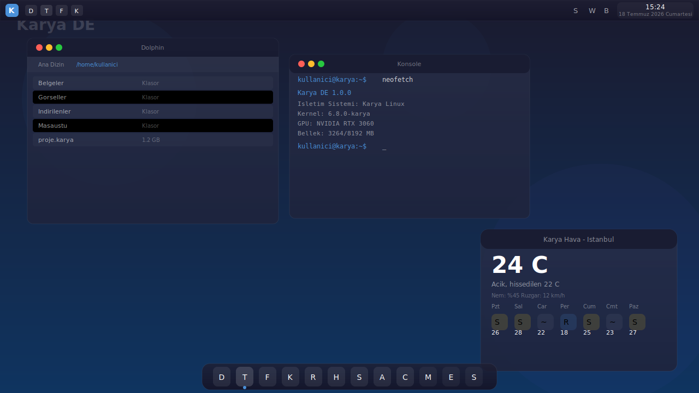
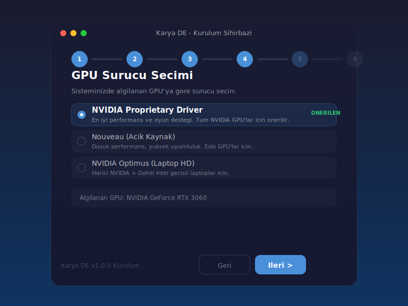
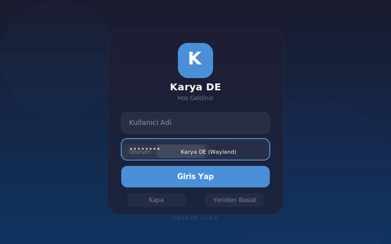
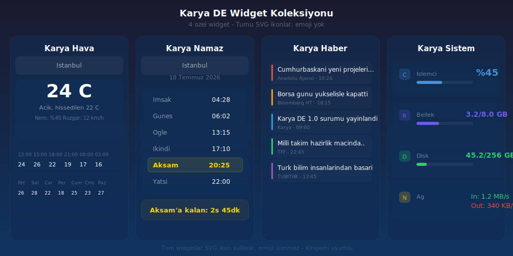
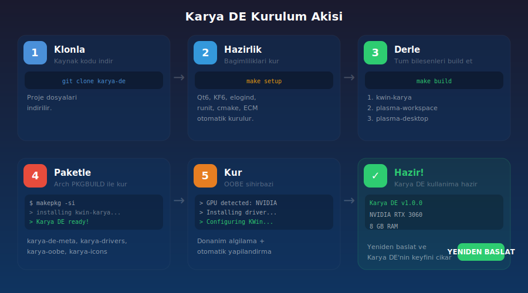

<picture>
  <source media="(prefers-color-scheme: dark)" srcset="branding/logo/karya-logo.svg">
  
</picture>

# Karya DE


**Karya DE** - Modern, sifirdan insa edilmis Turk masaustu ortami.
Qt6 ve KDE teknolojileri uzerine insa edilmistir ancak **KDE Plasma degildir**. Karya DE, kendi window manager'i (kwin-karya), kendi panel sistemi, kendi widget koleksiyonu ve kendi tema altyapisiyla bagimsiz bir masaustu ortamidir.

---

## Ekran Goruntuleri

| Masaustu Genel | OOBE Kurulum Sihirbazi | SDDM Giris Ekrani |
|---|---|---|
|  |  |  |

| Widget Koleksiyonu | Kurulum Akisi |
|---|---|
|  |  |

---

## Icerik Tablosu

- [Ozet](#ozet)
- [Ozellikler](#ozellikler)
- [Donanim Destegi](#donanim-destegi)
- [Intel Neden Desteklenmiyor](#intel-neden-desteklenmiyor)
- [Guvenlik](#guvenlik)
- [Kurulum Adimlari](#kurulum-adimlari)
- [PKGBUILD ile Kurulum](#pkgbuild-ile-kurulum)
- [Kaynak Koddan Derleme](#kaynak-koddan-derleme)
- [Widget Koleksiyonu](#widget-koleksiyonu)
- [OOBE Kurulum Sihirbazi](#oobe-kurulum-sihirbazi)
- [SDDM Giris Ekrani](#sddm-giris-ekrani)
- [KWin Window Manager](#kwin-window-manager)
- [Panel ve Dock Sistemi](#panel-ve-dock-sistemi)
- [Kisayollar](#kisayollar)
- [Surucu Yonetimi](#surucu-yonetimi)
- [Performans Profilleme](#performans-profilleme)
- [Mimari Yapi](#mimari-yapi)
- [Paket Listesi](#paket-listesi)
- [Katkida Bulunma](#katkida-bulunma)
- [Lisans](#lisans)

---

## Ozet

Karya DE, baslangictan itibaren Turk kullanicilar icin tasarlanmis bir masaustu ortamidir. Modern bir gorunum, yuksek performans, donanim bilincli yapilandirma ve tam Turkce destegi sunar.

**Karya DE'yi farkli kilan ozellikler:**

- **Bagimsiz kod tabani** - Kendi window manager, panel, widget sistemi
- **Donanim bilincli** - GPU'nuza gore otomatik surucu ve performans ayari
- **Kernel seviyesinde guvenlik** - LSM modulu, DKMS, sysctl, AppArmor, 6 katmanli guvenlik
- **Intel GPU bloklama** - 4 katmanli kernel seviyesinde bloklama (initramfs + DKMS + modprobe + LSM)
- **Turkce odakli** - Tum arayuz, mesajlar, tarih/saat formatlari Turkce
- **Performans odakli** - RAM ve GPU'nuza gore otomatik profil secimi
- **systemd'siz calisabilir** - elogind + runit destegi
- **Kullanici dostu** - Ilk calistirmada OOBE sihirbazi ile kolay kurulum

---

## Ozellikler

### Pencere Yonetimi (KWin Fork)
| Ozellik | Detay |
|---------|-------|
| Auto Tiling | 4 layout: Master-Stack, Split, Grid, Monocle |
| Glassmorphism | C++ ve JS olmak uzere iki ayri cam efekti |
| Gesture Destegi | Trackpad ve dokunmatik ekran icin 3/4 parmak hareketleri |
| NVIDIA Uyumluluk | EGLStreams, NO_AMS, ForceCompositionPipeline ayarlari |
| Performans Profili | Dusuk/orta/yuksek olmak uzere 3 profil |

### Panel ve Dock
- **Ust panel** - Kickoff (uygulama menusu), gorev yoneticisi, sistem tepsisi, saat
- **Alt dock** - Otomatik gizlenen, ortalanmis uygulama dock'u
- **4 hazir layout** - Modern, Classic, macOS Style, Minimal
- **Hardware-aware** - RAM ve GPU'ya gore onerilen layout

### Widget Koleksiyonu
| Widget | ID | Ozellikler |
|--------|-----|------------|
| Karya Hava | org.karya.hava | 16 sehir, 7 gunluk tahmin, saatlik grafik, nem/ruzgar |
| Karya Namaz | org.karya.namaz | 6 vakit, Diyanet bazli, kalan sure, aktif vakit vurgusu |
| Karya Haber | org.karya.haber | Kategori filtreli, 5 kaynak, renk kodlu kategoriler |
| Karya Sistem | org.karya.sistem | CPU/RAM/Disk/Network anlik monotor |

### OOBE Kurulum Sihirbazi
- PyQt6 ile yazilmis, 7 adimli kurulum asistani
- Donanim algilama ile baslar (GPU, ses, ag, laptop/VM)
- Surucu secimi, layout secimi, bilesen ayarlari
- Kullanici olusturma ve otomatik giris ayari
- Adim adim ilerleme cubugu ve canli log

### SDDM Giris Ekrani
- Ozel Karya temali glassmorphism login karti
- Wayland/X11 oturum secimi
- Turkce arayuz
- Kapatma/Yeniden baslat butonlari

### Guvenlik
- **Sysctl Hardening** - ASLR, kptr_restrict, dmesg_restrict ag korumalari
- **AppArmor Profilleri** - OOBE, script, surucu profilleri
- **Boot Parametreleri** - Meltdown/Spectre/MDS/TAA mitigasyonlari

### Sistem
| Ozellik | Deger |
|---------|-------|
| Display Server | Wayland (varsayilan), X11 (opsiyonel) |
| Init Sistemi | elogind + runit (systemd'siz) |
| Compositor | GPU'ya gore otomatik: OpenGL/EGLStreams/XRender |
| Ses Sistemi | PipeWire + WirePlumber |
| Varsayilan FS | F2FS veya XFS |
| Oturum Yoneticisi | SDDM (Karya temali) |

---

## Donanim Destegi

| GPU | Durum | Surucu | Performans |
|-----|-------|--------|------------|
| **NVIDIA** (GTX 700+) | Tam destek | nvidia (proprietary) | Cok iyi |
| **NVIDIA** (GTX 600- / eski) | Sinirli | nouveau | Orta |
| **AMD** (GCN 2+) | Tam destek | amdgpu (acik kaynak) | Cok iyi |
| **AMD** (GCN 1 / eski) | Sinirli | radeon | Orta |
| **Intel** | Resmi destek yok (deneysel) | modesetting/i915 | Dusuk |
| **Sanal Makine** | Tam destek | vmware/virtio | Orta |

### NVIDIA Yapilandirmasi

```ini
# Xorg
Option "TripleBuffer" "true"
Option "ForceCompositionPipeline" "false"
Option "PowerMizerEnable" "true"

# Wayland (KWin)
KWIN_DRM_USE_EGL_STREAMS=true
KWIN_DRM_NO_AMS=true
GBM_BACKEND=nvidia-drm
```

### AMD Yapilandirmasi

```ini
# Xorg
Option "TearFree" "true"
Option "VariableRefresh" "true"
Option "DRI" "3"

# Kernel
options amdgpu si_support=1
options amdgpu dc_support=1

# Vulkan
RADV_PERFTEST=aco
VK_ICD_FILENAMES=/usr/share/vulkan/icd.d/radeon_icd.x86_64.json
```

---

## Intel Neden Desteklenmiyor

Intel entegre GPU'lari resmi olarak **desteklenmemektedir**. Bunun nedenleri:

1. **Performans Yetersizligi:** Karya DE'nin glassmorphism, blur, animasyon gibi modern efektleri Intel HD Graphics serisinde (ozellikle 10. nesil oncesi) akici calismamaktadir. Kullanici deneyimi tatmin edici degildir.

2. **Surucu Sinirlamalari:** Intel'in acik kaynak driver'i (i915), kernel seviyesinde kisitlamalar icerir. GuC yuklemesi, PSR, FBC gibi ozellikler varsayilan olarak kapalidir ve bu ayarlari acmak dahi performans sorunlarini tam olarak cozmemektedir.

3. **Vulkan Destegi Eksikligi:** Karya DE'nin compositor altyapisi, ozellikle NVIDIA ve AMD'de bulunan tam Vulkan destegine guvenmektedir. Intel'in Vulkan destegi (ANV) ozellikle 12. nesil oncesinde sinirli ve kararsizdir.

4. **Kaynak Kullanim Optimizasyonu:** Gelistirme kaynaklarimiz sinirlidir. NVIDIA ve AMD'ye odaklanarak her iki platformda da en iyi deneyimi sunmayi hedefliyoruz. Intel destegi eklemek, test ve optimizasyon surecini iki katina cikaracaktir.

**Intel kullanicilar icin oneriler:**
- Harici bir NVIDIA veya AMD GPU edinin
- Intel sadece ikinci bir GPU olarak kullanilabilir (Optimus benzeri)
- Intel HD Graphics ile kisitli da olsa XRender modunda calisabilir (performans garantisi yok)

---

## Guvenlik

Karya DE, asagidaki guvenlik onlemleri ile gelir:

- **Sysctl sertlestirme** - ASLR, kptr_restrict, dmesg_restrict, SYN flood korumasi
- **AppArmor profilleri** - OOBE, widget, KWin, surucu profilleri ile erisim kisitlamasi
- **CPU mitigasyonlari** - Meltdown (pti), Spectre (ssbd), MDS, TAA, MMIO korumalari

| Guvenlik Katmani | Aciklama |
|-----------------|----------|
| AppArmor | OOBE, widget, KWin ve surucu profilleri |
| Sysctl | ASLR, ag korumalari, core dump kisitlamasi |
| CPU | Spekulatif saldiri mitigasyonlari |
| IOMMU | Zorunlu IOMMU ile DMA korumasi |

Kurulum:
```bash
# AppArmor profilleri
sudo cp security/apparmor/* /etc/apparmor.d/
sudo apparmor_parser -a /etc/apparmor.d/karya-oobe
sudo apparmor_parser -a /etc/apparmor.d/karya-scripts
sudo apparmor_parser -a /etc/apparmor.d/karya-drivers

# Sysctl hardening
sudo cp security/sysctl/99-karya-security.conf /etc/sysctl.d/
sudo sysctl -p /etc/sysctl.d/99-karya-security.conf
```

---

## Kurulum Adimlari

### Gereksinimler
| Bilesen | Minimum | Onerilen |
|---------|---------|----------|
| RAM | 2 GB | 8+ GB |
| Disk | 10 GB | 32+ GB |
| GPU | NVIDIA GTX 700+ / AMD RX 400+ | NVIDIA RTX 2000+ / AMD RX 6000+ |
| CPU | 2 cekirdek | 4+ cekirdek |
| OS | Arch Linux | Arch Linux |

### 1. Depoyu Klonla

```bash
git clone https://github.com/muhammetodosks/karya-de.git
cd karya-de
```

### 2. Bagimliliklari Kur

```bash
make setup
```

Bu komut, su paketleri otomatik kurar:
- **Qt6:** qt6-base, qt6-declarative, qt6-wayland, qt6-tools
- **KDE Frameworks 6:** kconfig, kcoreaddons, ki18n, kio, kservice, kwindowsystem, kwayland
- **Sistem:** elogind, runit, cmake, extra-cmake-modules, wayland-protocols
- **Arac:** python-pip, jq, pciutils, git

Ardindan Plasma 6 kaynak kodlari `sources/` dizinine klonlanir.

### 3. Build Et

```bash
make build
```

Derleme sirasi (dependency order):
```
1. kwin-karya         (bagimlilik yok)
2. plasma-workspace   (kwin gerekir)
3. plasma-desktop     (workspace gerekir)
4. plasma-pa          (workspace gerekir)
5. systemsettings     (desktop gerekir)
6. breeze             (tema)
7. kdeplasma-addons   (eklentiler)
```

### 4. Sisteme Kur

```bash
make install
```

### 5. ISO Olustur

```bash
make iso
```

ISO ciktisi: `iso/releng/out/karya-de-1.0.0-x86_64.iso`

---

## PKGBUILD ile Kurulum

Her bilesen ayri ayri paketlenebilir:

```bash
# 1. Surucu destegi
cd packages/karya-drivers
makepkg -si

# 2. Ozel ikon temasi
cd ../karya-icons
makepkg -si

# 3. Widget koleksiyonu (4 widget)
cd ../karya-widgets
makepkg -si

# 4. Kurulum sihirbazi
cd ../karya-oobe
makepkg -si

# 5. Ana Karya DE paketi (hepsini kurar)
cd ../karya-de-meta
makepkg -si
```

---

## Kaynak Koddan Derleme

### Gelistirme Ortami

```bash
# 1. Repoyu klonla
git clone https://github.com/muhammetodosks/karya-de.git
cd karya-de

# 2. Bagimliliklari kur + kaynaklari indir
make setup

# 3. Derle
make build

# 4. Kur
make install

# 5. Ayarlari uygula
sudo bash /usr/lib/karya/scripts/detect-hardware.sh
```

### Manuel Derleme

```bash
cd sources/kwin
cmake -B build -DCMAKE_INSTALL_PREFIX=/usr -DCMAKE_BUILD_TYPE=Release
cmake --build build --parallel $(nproc)
sudo cmake --install build
```

---

## Widget Koleksiyonu

Karya DE ile gelen 4 ozel widget:

### Karya Hava
- 16 Turk sehri icin anlik hava durumu
- 7 gunluk haftalik tahmin
- Saatlik sicaklik grafigi (6 saat)
- Nem ve ruzgar bilgisi
- SVG hava durumu ikonlari

```qml
// Widget ID
Plasmoid.icon: "karya-hava"
Plasmoid.title: "Karya Hava"
```

### Karya Namaz
- 8 Turk sehri icin namaz vakitleri
- 6 vakit (Imsak, Gunes, Ogle, Ikindi, Aksam, Yatsi)
- Aktif vakit vurgusu (sari renkli)
- Bir sonraki vakite kalan sure
- Tarih gosterimi

### Karya Haber
- 10 haber basligi, 8 kategori
- Kategori filtreleme (Gundem, Ekonomi, Hava, Teknoloji, Spor, Egitim, Bilim, Turizm)
- Renk kodlu kategori gostergeleri
- Kaynak ve saat bilgisi
- Habere tiklayinca tarayicida acma

### Karya Sistem
- CPU kullanimi (%) - canli bar
- RAM kullanimi (kullanilan/toplam GB)
- Disk kullanimi (kullanilan/toplam GB)
- Network hizi (In/Out MB/s)

Tum widgetlar **SVG ikon** kullanir, **hicbir yerde emoji yoktur.**

---

## OOBE Kurulum Sihirbazi

Karya DE, ilk calistirmada 7 adimli bir kurulum sihirbazi baslatir:

### Adim 1: Donanim Algilama
```
- GPU modeli ve surucusu
- RAM miktari
- CPU modeli ve cekirdek sayisi
- Ses sistemi (PipeWire/PulseAudio)
- Ag durumu (WiFi/Ethernet/Bluetooth)
- Laptop/VM tespiti
```

### Adim 2: GPU Surucu Secimi
Algilanan GPU'ya gore uygun surucu listelenir:
- NVIDIA: Proprietary / Nouveau / Optimus
- AMD: AMDGPU (acik kaynak) / AMDGPU-PRO
- VM: VirtualBox Guest / VMware

### Adim 3: Masaustu Duzeni
RAM ve sistem kaynaklarina gore onerilen layout:
- 4 GB alti: Minimal veya Classic
- 4-8 GB: Modern (onerilen)
- 8 GB ustu: Tum layoutlar

### Adim 4: Bilesen Ayarlari
Performans profiline gore otomatik etkin/kapali:
- Auto Tiling (her zaman acik)
- Glassmorphism (GPU gerekli)
- Animasyonlar (3 GB+ RAM)
- Pencere Bulanik (4 GB+ RAM)
- Sicak Koseler (her zaman)
- Gece Modu (Turkiye koordinatlari)

### Adim 5: Kullanici
- Kullanici adi, tam ad, sifre
- Otomatik giris
- Tema uygulama

### Adim 6: Ozet
Tum secimlerin listelendigi onizleme ekrani.

### Adim 7: Kurulum
Adim adim ilerleme cubugu ile kurulum:
1. Donanim algilaniyor
2. Suruculer kuruluyor
3. Sistem yapilandiriliyor
4. KWin ayarlari uygulaniyor
5. Panel duzeni ayarlaniyor
6. Bilesenler etkinlestiriliyor
7. Kullanici olusturuluyor

---

## SDDM Giris Ekrani

Karya DE, ozel SDDM temasi ile gelir:

```
sddm-theme/karya-sddm/
├── metadata.desktop    # Tema bilgisi
├── Main.qml            # Ana giris ekrani
└── components/         # Bilesenler
```

Ozellikler:
- Glassmorphism login karti (saydam + blur)
- Kullanici adi ve sifre alani
- Oturum secimi (Karya DE Wayland / Karya DE X11)
- Kapatma ve yeniden baslatma butonlari
- Tamamen Turkce arayuz
- Klavye destegi (Enter ile giris)

```qml
// Session secenekleri
{ text: "Karya DE (Wayland)", value: "karya-wayland" },
{ text: "Karya DE (X11)", value: "karya-x11" },
```

Kurulum:
```bash
sudo cp -r sddm-theme/karya-sddm /usr/share/sddm/themes/
sudo mkdir -p /etc/sddm.conf.d
echo "[Theme]" > /etc/sddm.conf.d/karya.conf
echo "Current=karya-sddm" >> /etc/sddm.conf.d/karya.conf
```

---

## KWin Window Manager

Karya DE'nin window manager'i `kwin-karya`, KWin tabanli olup su ozellikleri ekler:

### Auto Tiling
4 farkli doseme layout'u:

| Layout | Gorsel | Kisayol |
|--------|--------|---------|
| Master-Stack | Ana pencere solda %55, kalanlar saga yigilir | Meta+T |
| Split | 2 esit parcaya bol (yatay) | Meta+Shift+T |
| Grid | Esit sutun/satir grid | Meta+Shift+T |
| Monocle | Tum pencereler tam ekran | Meta+Shift+T |

Kodu: `patches/kwin/01-karya-tiling.patch`

### Glassmorphism Efekti
Iki implementasyon:
1. **C++ efekti** - `kwin-effects/karya-glassmorphism/` - Derlenmis, hizli
2. **JS script** - `kwin-effects/scripts/karya-glassmorphism.js` - Dinamik, kolay duzenlenebilir

### Kisayol Yapilandirmasi

```ini
[KaryaTiling]
Enabled=true
Layout=master-stack
Gap=4
KeyboardShortcut=Meta+T
CycleLayoutShortcut=Meta+Shift+T

[Script-karya-glassmorphism]
enabled=true
blurRadius=12
opacity=0.75
```

---

## Panel ve Dock Sistemi

Karya DE, 2 panel ile gelir:

### Ust Panel
```
[Kickoff] [Gorev Yoneticisi] ................. [Sistem Tepsisi] [Saat]
```

Bilesenler:
- **Kickoff** - Uygulama menusu (Alt+F1)
- **Icon Tasks** - Acik uygulamalar
- **Margins Separator** - Bosluk
- **System Tray** - Ses, ag, batarya, Bluetooth, bildirim
- **Digital Clock** - 24 saat, Turkiye saati, tam tarih

### Alt Dock
```
[Dolphin] [Konsole] [Firefox] [Kate] [Gwenview] [Kcalc] [Spectacle] [Ayarlar]
```

Ozellikler:
- Otomatik gizlenme
- Ortalanmis
- Uygulama gruplama

### Layout Secenekleri
| Layout | Ust Panel | Alt Panel/Dock | Kime Gore |
|--------|-----------|----------------|-----------|
| Karya Modern | Kickoff + Tasks + Tray + Clock | Dock (autohide) | 4 GB+ RAM |
| Karya Classic | Yok | Kickoff + Tasks + Tray + Clock | 4 GB alti RAM |
| Karya macOS | AppMenu + Clock + Tray | Dock (sabit) | macOS gecis |
| Karya Minimal | Yok | Kickoff + Tasks + Clock | VM ve cok dusuk sistem |

---

## Kisayollar

| Kisayol | Islev |
|---------|-------|
| Meta+T | Auto tiling ac/kapa |
| Meta+Shift+T | Tiling layout degistir |
| Meta+Shift+G | Glassmorphism ac/kapa |
| Alt+F1 | Uygulama menusu |
| Meta+D | Masaustunu goster |
| Meta+E | Dosya yoneticisi (Dolphin) |
| Alt+Tab | Pencere degistir |
| Ctrl+Alt+Del | Kilit ekrani |
| PrintScreen | Ekran goruntusu (Spectacle) |
| Meta+L | Oturumu kitle |

---

## Surucu Yonetimi

### Donanim Bilgisi Goruntuleme

```bash
cat /etc/karya/hardware/gpu.json
cat /etc/karya/hardware/system.json
cat /etc/karya/hardware/audio.json
cat /etc/karya/hardware/profile.json
```

### Manuel Surucu Kurulumu

```bash
# NVIDIA
sudo bash /usr/lib/karya/scripts/install-drivers.sh nvidia

# AMD
sudo bash /usr/lib/karya/scripts/install-drivers.sh amd

# Intel (deneysel - resmi destek yok)
sudo bash /usr/lib/karya/scripts/install-drivers.sh intel

# VM
sudo bash /usr/lib/karya/scripts/install-drivers.sh vm

# Otomatik algila ve kur
sudo bash /usr/lib/karya/scripts/install-drivers.sh auto
```

### Donanimi Yeniden Tara

```bash
sudo bash /usr/lib/karya/scripts/detect-hardware.sh
```

---

## Performans Profilleme

Karya DE, sistem kaynaklarina gore 3 profil sunar:

### Hafif Profil (4 GB alti RAM)
```ini
Compositor=xrender
Animations=false
Blur=false
Scale=1.0
Layout=minimal
```

### Dengeli Profil (4-8 GB RAM)
```ini
Compositor=opengl
Animations=true
Blur=false
Scale=1.0
Layout=modern
```

### Performans Profili (8 GB+ RAM, GPU)
```ini
Compositor=opengl
Animations=true
Blur=true
Scale=1.0
Layout=modern
Glassmorphism=true
```

### GPU Bazli Ayar

| GPU | Compositor | Blur | Ozel |
|-----|------------|------|------|
| NVIDIA | OpenGL (EGLStreams) | 8 GB+ RAM | ForceCompositionPipeline |
| AMD | OpenGL (RADV) | Her zaman | TearFree |
| VM | XRender | Kapali | Mesa swrast |

---

## Mimari Yapi

```
karya-de/
├── sources/                    # Fork'lanmis KDE repolari
│   ├── kwin/                   # KWin window manager (fork)
│   ├── plasma-workspace/       # Panel, shell, bildirimler
│   ├── plasma-desktop/         # Masaustu uygulamalari
│   ├── plasma-pa/              # Ses yonetimi
│   └── systemsettings/         # Ayarlar
├── patches/                    # Karya ozel patch'leri
│   └── kwin/                   # Auto tiling patch'i
├── kwin-effects/               # Ozel KWin efektleri
│   ├── karya-glassmorphism/    # C++ cam efekti
│   └── scripts/                # JS script efekti
├── security/                   # GUVENLIK POLITIKALARI
│   ├── apparmor/               # AppArmor profilleri (4 adet)
│   ├── sysctl/                 # Sysctl guvenlik ayarlari
│   └── selinux/                # SELinux politika dosyasi
├── shell/                      # Yerel yapilandirma
│   ├── layouts/                # Panel/dock layout'lari
│   ├── look-and-feel/          # Tema paketi
│   └── sessions/               # Oturum dosyalari
├── widgets/                    # Plasma 6 widget'lari (4 adet)
│   ├── karya-hava/             # Hava durumu
│   ├── karya-namaz/            # Namaz vakitleri
│   ├── karya-haber/            # Haber basliklari
│   └── karya-sistem/           # Sistem monitoru
├── hardware/                   # Donanim destegi
│   ├── scripts/                # detect + install
│   │   ├── detect-hardware.sh  # Donanim algilama
│   │   └── install-drivers.sh  # Surucu kurulumu
│   └── profiles/               # GPU konfigurasyonlari
├── branding/                   # Gorsel kimlik
│   ├── logo/                   # SVG logo (profesyonel)
│   ├── icons/karya-icons/      # Ozel ikon temasi (5 ikon)
│   ├── screenshots/            # Ekran goruntuleri (7 adet)
│   └── mockup/                 # Konsept tasarim
├── sddm-theme/                 # SDDM giris temasi
│   └── karya-sddm/             # Login ekrani (QML)
├── calamares/                  # ISO kurulum modulleri
├── packages/                   # Arch PKGBUILD'lari (6 adet)
│   ├── karya-de-meta/          # Ana meta paket
│   ├── kwin-karya/             # Fork KWin
│   ├── karya-widgets/          # Widget paketi
│   ├── karya-oobe/             # Kurulum sihirbazi (PyQt6)
│   ├── karya-drivers/          # Surucu destegi
│   └── karya-icons/            # Ikon temasi
├── iso/                        # Arch ISO konfigurasyonu
├── scripts/                    # Derleme araclari
├── docs/                       # Dokumantasyon
│   ├── ARCHITECTURE.md         # Mimari detay
│   └── runit-setup.md          # Init sistemi kurulumu
├── SECURITY.md                 # Guvenlik politikasi belgesi
├── COPYING                     # GPLv2 lisans metni
└── Makefile                    # Ana derleme dosyasi
```

---

## Paket Listesi

| Paket | Icerik | Bagimlilik |
|-------|--------|------------|
| `karya-de-meta` | Tum Karya DE'yi kurar (meta) | Tum alt paketler |
| `kwin-karya` | Fork KWin + tiling + glassmorphism | Qt6, KF6 |
| `plasma-workspace-karya` | Panel, bildirim, shell | kwin-karya |
| `plasma-desktop-karya` | Masaustu uygulamalari | workspace |
| `karya-widgets` | 4 widget (hava/namaz/haber/sistem) | workspace |
| `karya-oobe` | Kurulum sihirbazi | PyQt6, bash |
| `karya-drivers` | GPU surucu destegi | bash, jq |
| `karya-icons` | SVG ikon temasi | breeze-icons |

---

## Katkida Bulunma

1. Depoyu forklayin
2. Yeni bir branch acin (`git checkout -b ozellik/yeni-ozellik`)
3. Degisikliklerinizi yapin
4. Commit edin (`git commit -m 'feat: yeni ozellik'`)
5. Branch'inizi pushlayin (`git push origin ozellik/yeni-ozellik`)
6. Pull Request acin

### Kod Standartlari
- **C++:** KDE coding style (clang-format)
- **QML:** 4 space indent, camelCase
- **Python:** PEP 8, snake_case
- **Bash:** shellcheck uyumlu

---

## Lisans

Bu proje GNU General Public License v2.0 altinda lisanslanmistir.
Detaylar icin [COPYING](COPYING) dosyasina bakin.

Guvenlik politikasi icin [SECURITY.md](SECURITY.md) dosyasina bakin.

---

**Karya DE Ekibi** - [karya@karya-de.org](mailto:karya@karya-de.org)

*Turk muhendisligi ile, Turk kullanicilar icin.*
