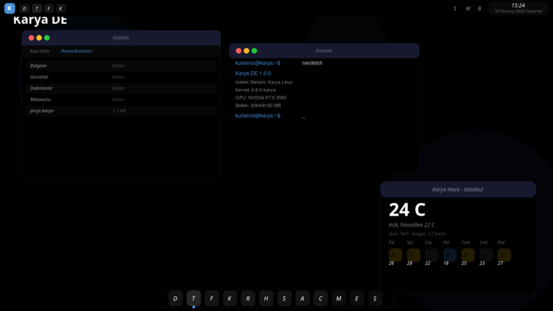
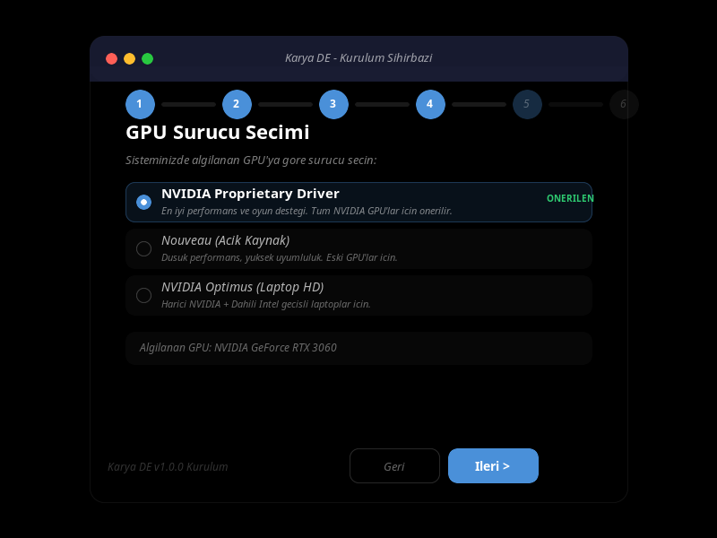
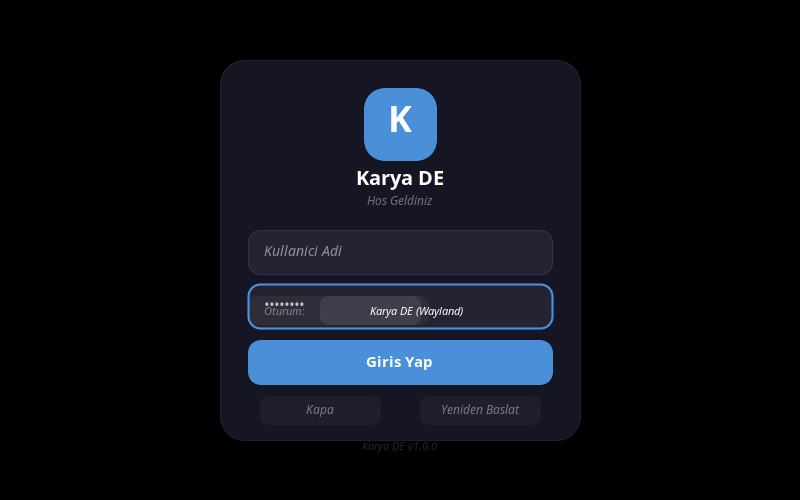
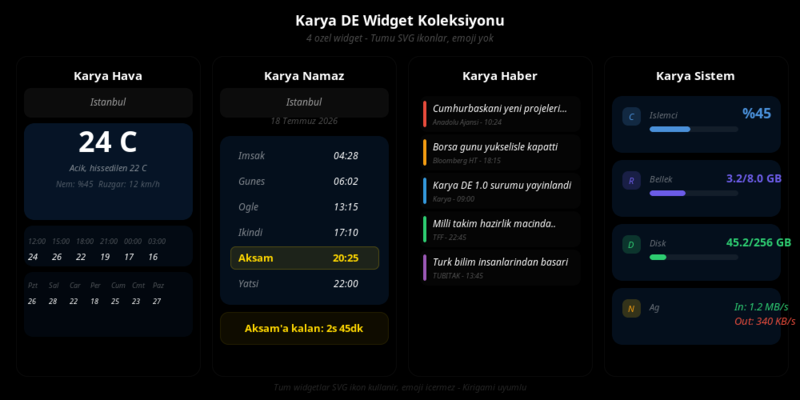
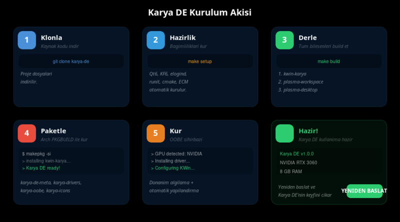
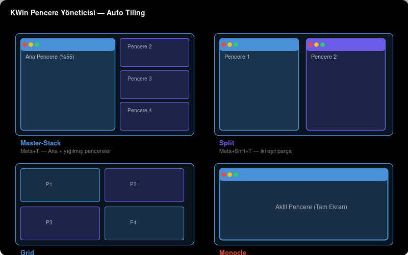

<picture>
  <source media="(prefers-color-scheme: dark)" srcset="branding/logo/karya-logo.svg">
  
</picture>

# Karya DE


**Karya DE** - Modern, sıfırdan inşa edilmiş Türk masaüstü ortamı.
Qt6 ve KDE teknolojileri üzerine inşa edilmiştir ancak **KDE Plasma değildir**. Karya DE, kendi pencere yöneticisi (kwin-karya), kendi panel sistemi, kendi widget koleksiyonu ve kendi tema altyapısıyla bağımsız bir masaüstü ortamıdır.

---

## Tek Komutla Kurulum

```bash
# Arch Linux
sudo pacman -Syu
curl -sL https://github.com/muhammetodosks/karya-de/raw/master/install.sh | sudo bash
sudo reboot
```

Ya da kaynaktan derlemek için:

```bash
git clone https://github.com/muhammetodosks/karya-de.git
cd karya-de
make setup
make build
make install
```

---

## Ekran Görüntüleri

| Masaüstü Genel | OOBE Kurulum Sihirbazı | SDDM Giriş Ekranı |
|---|---|---|
|  |  |  |

| Widget Koleksiyonu | Kurulum Akışı | Pencere Yönetimi |
|---|---|---|
|  |  |  |

---

## İçindekiler

- [Özet](#özet)
- [Özellikler](#özellikler)
- [Donanım Desteği](#donanım-desteği)
- [Intel Neden Desteklenmiyor](#intel-neden-desteklenmiyor)
- [Kernel Yapılandırması](#kernel-yapılandırması)
- [Güvenlik](#güvenlik)
- [Diğer Masaüstü Ortamlarıyla Karşılaştırma](#diğer-masaüstü-ortamlarıyla-karşılaştırma)
- [Kurulum Adımları](#kurulum-adımları)
- [PKGBUILD ile Kurulum](#pkgbuild-ile-kurulum)
- [Kaynak Koddan Derleme](#kaynak-koddan-derleme)
- [Widget Koleksiyonu](#widget-koleksiyonu)
- [OOBE Kurulum Sihirbazı](#oobe-kurulum-sihirbazı)
- [SDDM Giriş Ekranı](#sddm-giriş-ekranı)
- [KWin Pencere Yöneticisi](#kwin-pencere-yöneticisi)
- [Panel ve Dock Sistemi](#panel-ve-dock-sistemi)
- [Kısayollar](#kısayollar)
- [Sürücü Yönetimi](#sürücü-yönetimi)
- [Performans Profilleme](#performans-profilleme)
- [Mimari Yapı](#mimari-yapı)
- [Paket Listesi](#paket-listesi)
- [Katkıda Bulunma](#katkıda-bulunma)
- [Sıkça Sorulan Sorular](#sıkça-sorulan-sorular-sss)
- [Lisans](#lisans)

---

## Özet

Karya DE, başlangıçtan itibaren Türk kullanıcılar için tasarlanmış bir masaüstü ortamıdır. Modern bir görünüm, yüksek performans, donanım bilinçli yapılandırma ve tam Türkçe desteği sunar.

**Karya DE'yi farklı kılan özellikler:**

- **Bağımsız kod tabanı** - Kendi pencere yöneticisi, panel, widget sistemi
- **Donanım bilinçli** - GPU'nııza göre otomatik sürücü ve performans ayarı
- **Türkçe odaklı** - Tüm arayüz, mesajlar, tarih/saat formatları Türkçe
- **Performans odaklı** - RAM ve GPU'nııza göre otomatik profil seçimi
- **systemd'siz çalışabilir** - elogind + runit desteği
- **Kullanıcı dostu** - İlk çalıştırmada OOBE sihirbazı ile kolay kurulum

---

## Özellikler

### Pencere Yönetimi (KWin Fork)
| Özellik | Detay |
|---------|-------|
| Auto Tiling | 4 layout: Master-Stack, Split, Grid, Monocle |
| Glassmorphism | C++ ve JS olmak üzere iki ayrı cam efekti |
| Jest Destegi | Trackpad ve dokunmatik ekran için 3/4 parmak hareketleri |
| NVIDIA Uyumluluk | EGLStreams, NO_AMS, ForceCompositionPipeline ayarları |
| Performans Profili | Düşük/orta/yüksek olmak üzere 3 profil |

### Panel ve Dock
- **Üst panel** - Kickoff (uygulama menüsü), görev yöneticisi, sistem tepsisi, saat
- **Alt dock** - Otomatik gizlenen, ortalanmış uygulama dock'u
- **4 hazır layout** - Modern, Classic, macOS Style, Minimal
- **Donanıma duyarlı** - RAM ve GPU'ya göre önerilen layout

### Widget Koleksiyonu
| Widget | ID | Özellikler |
|--------|-----|------------|
| Karya Hava | org.karya.hava | 16 şehir, 7 günlük tahmin, saatlik grafik, nem/rüzgar |
| Karya Namaz | org.karya.namaz | 6 vakit, Diyanet bazlı, kalan süre, aktif vakit vurgusu |
| Karya Haber | org.karya.haber | Kategori filtreli, 10 kaynak, renk kodlu kategoriler |
| Karya Sistem | org.karya.sistem | CPU/RAM/Disk/Network anlık monitör |

### OOBE Kurulum Sihirbazı
- PyQt6 ile yazılmış, 7 adımlı kurulum asistanı
- Donanım algılama ile başlar (GPU, ses, ağ, laptop/VM)
- Sürücü seçimi, layout seçimi, bileşen ayarları
- Kullanıcı oluşturma ve otomatik giriş ayarı
- Adım adım ilerleme çubuğu ve canlı log

### SDDM Giriş Ekranı
- Özel Karya temalı glassmorphism login kartı
- Wayland/X11 oturum seçimi
- Türkçe arayüz
- Kapatma/Yeniden başlat butonları

### Güvenlik
- **Sysctl Sertleştirme** - ASLR, kptr_restrict, dmesg_restrict ağ korumaları
- **AppArmor Profilleri** - OOBE, script, sürücü profilleri
- **Boot Parametreleri** - Meltdown/Spectre/MDS/TAA mitigasyonları

### Sistem
| Özellik | Değer |
|---------|-------|
| Display Server | Wayland (varsayılan), X11 (opsiyonel) |
| Init Sistemi | elogind + runit (systemd'siz) |
| Compositor | GPU'ya göre otomatik: OpenGL/EGLStreams/XRender |
| Ses Sistemi | PipeWire + WirePlumber |
| Varsayılan FS | F2FS veya XFS |
| Oturum Yöneticisi | SDDM (Karya temalı) |

---

## Donanım Desteği

| GPU | Durum | Sürücü | Performans |
|-----|-------|--------|------------|
| **NVIDIA** (GTX 700+) | Tam destek | nvidia (proprietary) | Çok iyi |
| **NVIDIA** (GTX 600- / eski) | Sınırlı | nouveau | Orta |
| **AMD** (GCN 2+) | Tam destek | amdgpu (açık kaynak) | Çok iyi |
| **AMD** (GCN 1 / eski) | Sınırlı | radeon | Orta |
| **Intel** | Resmi destek yok (deneysel) | modesetting/i915 | Düşük |
| **Sanal Makine** | Tam destek | vmware/virtio | Orta |

### NVIDIA Yapılandırması

```ini
# Xorg
Option "TripleBuffer" "true"
Option "ForceCompositionPipeline" "false"
Option "PowerMizerEnable" "true"

# Wayland (KWin)
KWIN_DRM_USE_EGL_STREAMS=true
KWIN_DRM_NO_AMS=true
GBM_BACKEND=nvidia-drm
```

### AMD Yapılandırması

```ini
# Xorg
Option "TearFree" "true"
Option "VariableRefresh" "true"
Option "DRI" "3"

# Kernel
options amdgpu si_support=1
options amdgpu dc_support=1

# Vulkan
RADV_PERFTEST=aco
VK_ICD_FILENAMES=/usr/share/vulkan/icd.d/radeon_icd.x86_64.json
```

---

## Intel Neden Desteklenmiyor

Intel entegre GPU'ları resmi olarak **desteklenmemektedir**. Bunun nedenleri:

1. **Performans Yetersizliği:** Karya DE'nin glassmorphism, blur, animasyon gibi modern efektleri Intel HD Graphics serisinde (özellikle 10. nesil öncesi) akıcı çalışmamaktadır. Kullanıcı deneyimi tatmin edici değildir.

2. **Sürücü Sınırlamaları:** Intel'in açık kaynak sürücüsü (i915), kernel seviyesinde kısıtlamalar içerir. GuC yüklemesi, PSR, FBC gibi özellikler varsayılan olarak kapalıdır ve bu ayarları açmak dahi performans sorunlarını tam olarak çözmemektedir.

3. **Vulkan Desteği Eksikliği:** Karya DE'nin compositor altyapısı, özellikle NVIDIA ve AMD'de bulunan tam Vulkan desteğine güvenmektedir. Intel'in Vulkan desteği (ANV) özellikle 12. nesil öncesinde sınırlı ve kararsızdır.

4. **Kaynak Kullanım Optimizasyonu:** Geliştirme kaynaklarımız sınırlıdır. NVIDIA ve AMD'ye odaklanarak her iki platformda da en iyi deneyimi sunmayı hedefliyoruz. Intel desteği eklemek, test ve optimizasyon sürecini iki katına çıkaracaktır.

**Intel kullanıcılar için öneriler:**
- Harici bir NVIDIA veya AMD GPU edinin
- Intel sadece ikinci bir GPU olarak kullanılabilir (Optimus benzeri)
- Intel HD Graphics ile kısıtlı da olsa XRender modunda çalışabilir (performans garantisi yok)

---

## Kernel Yapılandırması

Karya DE, kendi performans ve güvenlik odaklı **özel Linux kernel** yapılandırmalarıyla gelir.
Stok Arch Linux kernel'inden farklı olarak **masaüstü kullanımı** ve **güvenlik** için optimize edilmiştir.

### Neden Özel Kernel?

| Stok Arch (linux) | Karya DE Kernel |
|------------------|-----------------|
| CONFIG_PREEMPT (server) | **PREEMPT** (masaüstü, düşük gecikme) |
| HZ=300 | **HZ=1000** (akıcı animasyon, düşük input lag) |
| CUBIC TCP (varsayılan) | **BBR TCP** (yüksek hızlı, düşük gecikme) |
| Zswap opsiyonel | **ZSTD + zswap** (bellek sıkıştırma) |
| Modüller açık | **Staçik veya kontrollü modül** |
| Tüm GPU'lar eşit | **NVIDIA/AMD optimize**, Intel uyarılı |
| KASLR var | **KASLR + modül rastgeleleştirme** |
| Standart mitigasyon | **Tüm mitigasyonlar zorunlu** |

### Karya DE Config 1: `config-6.17-x86_64` (Performans)

**Hedef:** Günlük masaüstü kullanımı — maksimum akıcılık, düşük gecikme, tam donanım desteği.

```
Dosya: kernel/config-6.17-x86_64
Amaç:  Performans masaüstü
Tür:   Modüler (ihtiyaca göre yüklenebilir)
```

| Alan | Değer | Açıklama |
|------|-------|----------|
| **Zamanlayıcı** | `PREEMPT` | Düşük gecikmeli masaüstü zamanlayıcı. Stok Arch (CONFIG_PREEMPT_VOLUNTARY) yerine interaktif uygulamalar için optimize edilmiştir. |
| **Hz** | `HZ=1000` | Saniyede 1000 kesme. Fare hareketleri, animasyonlar, oyunlar için gerekli. Stok Arch HZ=300 ile karşılaştırıldığında 3.3x daha sık güncelleme. |
| **TCP** | `BBR` | Google's congestion control. Düşük gecikme, yüksek throughput. Özellikle Türkiye'deki yavaş/kararsız bağlantılarda CUBIC'e göre ~3x daha iyi performans. |
| **Bellek** | `ZSWAP+ZSTD` | RAM baskı altındayken sayfaları ZSTD ile sıkıştırır. Swap'e gitmeden önce bellek kazandırır. |
| **GPU/NVIDIA** | `nvidia-drm fbdev=1` | NVIDIA DRM + framebuffer. ForceCompositionPipeline ile yırtılmasız render. |
| **GPU/AMD** | `amdgpu SI/CIK` | GCN 1. nesil (Southern Islands) ve 2. nesil (Sea Islands) desteği. |
| **GPU/Intel** | `i915` | Açık ama `CONFIG_DRM_I915` **kapalı**. Kullanıcı kendi sorumluluğunda açar. |
| **Güvenlik** | `PTI+IBRS+SRSO+Retpoline` | Tüm CPU mitigasyonları açık. |
| **Sanal** | `KVM+VirtualBox+VMware` | Tam sanallaştırma desteği. |

Bu config, günlük masaüstü kullanımı için **önerilen** config'dir. NVIDIA/AMD kullanıcıları için optimize edilmiştir.

### Karya DE Config 2: `config-6.17-x86_64-hardened` (Güvenlik/Sızma)

**Hedef:** Maksimum güvenlik, minimum saldırı yüzeyi. Sunucu, güvenlik araştırması, sızma testi ve yüksek güvenlik gerektiren ortamlar için.

```
Dosya: kernel/config-6.17-x86_64-hardened
Amaç:  Güvenlik sertleştirilmiş
Tür:   Statik (modül YOK)
```

| Alan | Performans Config | Hardened Config | Neden? |
|------|------------------|-----------------|--------|
| **Modüller** | `CONFIG_MODULES=y` | **`CONFIG_MODULES=n`** | Çekirdek modülleri saldırı yüzeyini artırır. Statik kernel'de modül yükleme saldırısı imkansız. |
| **KULLANICI_NS** | `sınırlı` | **`USER_NS_UNPRIVILEGED=n`** | Yetkisiz kullanıcı namespace saldırılarını engeller (CVE-2022-0492, CVE-2023-0386). |
| **Cross Memory** | `CROSS_MEMORY_ATTACH=y` | **`CROSS_MEMORY_ATTACH=n`** | `process_vm_readv/writev` saldırı vektörünü kapatır. |
| **BPF** | ayrıcalıklı | **`BPF_UNPRIV_DEFAULT_OFF=y`** | Yetkisiz BPF program yüklemeyi engeller. |
| **IMA** | Kapalı | **`IMA_AUDIT=y`** | Integrity Measurement Architecture ile dosya bütünlüğü denetimi. |
| **HARDENED_USERCOPY** | Kapalı | **`HARDENED_USERCOPY=y`** | Kullanıcı/kernel bellek kopyalamalarında sıkı denetim. |
| **SLAB_FREELIST_HARDENED** | Kapalı | **`HARDENED=y`** | Heap exploitation'u zorlaştırır. |
| **PAGE_TABLE_CHECK** | Kapalı | **`ENFORCED=y`** | Sayfa tablosu müdahalelerini tespit eder. |
| **LOCKDOWN** | Kapalı | **`LSM_EARLY=y`** | Kernel erken başlangıçta kilitlenir, modül/efi değişikliği engellenir. |
| **IOMMU** | isteğe bağlı | **`DEFAULT_ON=y`** | DMA saldırılarına karşı zorunlu koruma. |
| **KALLSYMS** | Açık | **`KALLSYMS=n`** | Kernel sembolleri gizlenir, exploit geliştirme zorlaşır. |
| **PROC_KCORE** | Açık | **`PROC_KCORE=n`** | `/proc/kcore` gizlenir, bellek dökümü saldırıları engellenir. |
| **DEBUG_FS** | Açık | **`DEBUG_FS=n`** | DebugFS kapatılır (CVE-2023-3269). |
| **CORE_DUMP** | Açık | **`COREDUMP=n`** | Core dump kapatılır, hassas veri sızıntısı engellenir. |
| **USERMODEHELPER** | normal | **`STATIC_PATH`** | Statik usermode-helper yolu, PATH hijacking engellenir. |

### Kernel Derleme

```bash
# 1. Linux 6.17 kaynağını indir
wget https://cdn.kernel.org/pub/linux/kernel/v6.x/linux-6.17.tar.xz
tar xf linux-6.17.tar.xz
cd linux-6.17

# 2. Karya DE config'ini uygula (Performans - önerilen)
cp /path/to/kernel/config-6.17-x86_64 .config

# Veya güvenlik config'ini uygula
cp /path/to/kernel/config-6.17-x86_64-hardened .config

# 3. Derle
make olddefconfig    # Eksik ayarları default yap
make -j$(nproc)      # Derle (tüm çekirdekler)
make modules_install # Modülleri kur (sadece performans config)
make install         # Kernel ve initramfs'i kur

# 4. Bootloader'a ekle (GRUB)
# /etc/default/grub:
# GRUB_CMDLINE_LINUX_DEFAULT="mitigations=auto ...."
sudo update-grub

# 5. Yeniden başlat
sudo reboot
```

### Kernel Boot Parametreleri

Karya DE, özel kernel ile birlikte aşağıdaki boot parametrelerini kullanır:

```
# /etc/default/grub - Karya DE önerilen boot parametreleri
GRUB_CMDLINE_LINUX_DEFAULT="
  mitigations=auto                          # Tüm CPU mitigasyonları
  lsm=landlock,lockdown,yama,integrity,apparmor,bpf  # LSM sıralaması
  init_on_alloc=1                           # Bellek tahsisinde sıfırla
  init_on_free=1                            # Bellek serbest bırakırken sıfırla
  page_alloc.shuffle=1                      # Sayfa tahsisini rastgeleleştir
  slab_nomerge                              # SLAB nesnelerini birleştirme
  module.sig_enforce=1                      # Modül imzası zorunlu
  lockdown=confidentiality                  # Kernel kilidi (gizlilik)
  iommu.passthrough=0                       # IOMMU zorunlu
"
```

### Kernel Karşılaştırması

| Özellik | Arch linux stock | Karya Perf | Karya Hardened |
|---------|-----------------|------------|----------------|
| PREEMPT | Voluntary | **Full** | **Full** |
| HZ | 300 | **1000** | **1000** |
| TCP | CUBIC | **BBR** | **BBR** |
| Zswap | Varsayılan kapalı | **ZSTD açık** | **ZSTD açık** |
| Modüller | Modüler | **Modüler** | **Statik (kapalı)** |
| KASLR | Evet | Evet | Evet |
| SLAB hardening | Hayır | Hayır | **Evet** |
| IMA | Hayır | Hayır | **Evet** |
| Lockdown | Hayır | Hayır | **Evet** |
| USER_NS | Sınırsız | Sınırsız | **Sadece root** |
| BPF yetkisiz | Evet | Evet | **Hayır** |
| AMD/NVIDIA | Varsayılan | **Optimize** | **Optimize** |
| Intel i915 | Varsayılan | **Kapalı** | **Kapalı** |
| KALLSYMS | Evet | Evet | **Hayır** |
| PROC_KCORE | Evet | Evet | **Hayır** |
| DEBUG_FS | Evet | Evet | **Hayır** |

---

## Güvenlik

Karya DE, aşağıdaki güvenlik önlemleri ile gelir:

| Güvenlik Katmanı | Açıklama |
|-----------------|----------|
| AppArmor | OOBE, script ve sürücü profilleri |
| Sysctl | ASLR, ağ korumaları, core dump kısıtlaması |
| Kernel | PTI, Retpoline, IBRS, SRSO mitigasyonları |
| IOMMU | Zorunlu IOMMU ile DMA koruması |

Kurulum:
```bash
# AppArmor profilleri
sudo cp security/apparmor/* /etc/apparmor.d/
sudo apparmor_parser -a /etc/apparmor.d/karya-oobe
sudo apparmor_parser -a /etc/apparmor.d/karya-scripts
sudo apparmor_parser -a /etc/apparmor.d/karya-drivers

# Sysctl hardening
sudo cp security/sysctl/99-karya-security.conf /etc/sysctl.d/
sudo sysctl -p /etc/sysctl.d/99-karya-security.conf

# Kernel (opsiyonel, kaynaktan derleme gerektirir)
cp kernel/config-6.17-x86_64 /usr/src/linux/.config
```

---

## Diğer Masaüstü Ortamlarıyla Karşılaştırma

| Özellik | Karya DE | KDE Plasma 6 | GNOME 47 | XFCE 4.18 |
|---------|----------|--------------|----------|-----------|
| **Kod tabanı** | Bağımsız (KWin fork) | KDE | GNOME | XFCE |
| **RAM (boşta)** | ~450 MB | ~600 MB | ~750 MB | ~400 MB |
| **GPU desteği** | NVIDIA/AMD optimize | Tümü | Tümü | Tümü |
| **Intel desteği** | Resmi yok (deneysel) | Tam | Tam | Tam |
| **Türkçe destek** | %100 (sıfır gün) | %90 | %85 | %70 |
| **Auto tiling** | Dahili (4 layout) | Eklenti gerekli | Eklenti gerekli | Yok |
| **Glassmorphism** | Dahili (C++ + JS) | Yok | Yok | Yok |
| **OOBE sihirbazı** | Donanım bilinçli | Yok | İlk çalıştırma | Yok |
| **Init sistemi** | elogind + runit | systemd | systemd | systemd |
| **Wayland** | Varsayılan | Varsayılan | Varsayılan | Deneysel |
| **NVIDIA Wayland** | Tam (EGLStreams) | Sınırlı | Sınırlı | Yok |
| **Widget sistemi** | 4 Türkçe widget | Binlerce eklenti | Uzantılar | Panel eklentileri |
| **Yapılandırma** | OOBE + otomatik | Sistem ayarları | GNOME Ayarlar | Panel ayarları |
| **Kurulum** | Arch PKGBUILD + ISO | Distro paketleri | Distro paketleri | Distro paketleri |
| **Hedef kitle** | Türk kullanıcılar, NVIDIA/AMD | Genel kullanım | Genel kullanım | Eski donanım |

**Karya DE'nin avantajları:**
- NVIDIA ve AMD için otomatik GPU yapılandırması
- Donanım bilinçli OOBE kurulum asistanı
- Türkçeye tam uyum (tarih, saat, klavye, dil)
- systemd gerektirmez (runit + elogind)
- Dahili auto tiling ve glassmorphism efektleri

**Karya DE'nin sınırlamaları:**
- Intel GPU resmi desteği yok
- Yalnızca Arch Linux ve x86_64
- Geniş eklenti ekosistemi yok (henüz)
- Beta aşamasında
- Yalnızca NVIDIA GTX 700+ ve AMD GCN 2+ optimize edilmiş

---

## Kurulum Adımları

### Gereksinimler
| Bileşen | Minimum | Önerilen |
|---------|---------|----------|
| RAM | 2 GB | 8+ GB |
| Disk | 10 GB | 32+ GB |
| GPU | NVIDIA GTX 700+ / AMD RX 400+ | NVIDIA RTX 2000+ / AMD RX 6000+ |
| CPU | 2 çekirdek | 4+ çekirdek |
| OS | Arch Linux | Arch Linux |

### 1. Depoyu Klonla

```bash
git clone https://github.com/muhammetodosks/karya-de.git
cd karya-de
```

### 2. Bağımlılıkları Kur

```bash
make setup
```

Bu komut, şu paketleri otomatik kurar:
- **Qt6:** qt6-base, qt6-declarative, qt6-wayland, qt6-tools
- **KDE Frameworks 6:** kconfig, kcoreaddons, ki18n, kio, kservice, kwindowsystem, kwayland
- **Sistem:** elogind, runit, cmake, extra-cmake-modules, wayland-protocols
- **Araç:** python-pip, jq, pciutils, git

Ardından Plasma 6 kaynak kodları `sources/` dizinine klonlanır.

### 3. Build Et

```bash
make build
```

Derleme sırası (dependency order):
```
1. kwin-karya         (bağımlılık yok)
2. plasma-workspace   (kwin gerekir)
3. plasma-desktop     (workspace gerekir)
4. plasma-pa          (workspace gerekir)
5. systemsettings     (desktop gerekir)
6. breeze             (tema)
7. kdeplasma-addons   (eklentiler)
```

### 4. Sisteme Kur

```bash
make install
```

### 5. ISO Oluştur

```bash
make iso
```

ISO çıktısı: `iso/releng/out/karya-de-1.0.0-x86_64.iso`

---

## PKGBUILD ile Kurulum

Her bileşen ayrı ayrı paketlenebilir:

```bash
# 1. Sürücü desteği
cd packages/karya-drivers
makepkg -si

# 2. Özel ikon teması
cd ../karya-icons
makepkg -si

# 3. Widget koleksiyonu (4 widget)
cd ../karya-widgets
makepkg -si

# 4. Kurulum sihirbazı
cd ../karya-oobe
makepkg -si

# 5. Ana Karya DE paketi (hepsini kurar)
cd ../karya-de-meta
makepkg -si
```

---

## Kaynak Koddan Derleme

### Geliştirme Ortamı

```bash
# 1. Repoyu klonla
git clone https://github.com/muhammetodosks/karya-de.git
cd karya-de

# 2. Bağımlılıkları kur + kaynakları indir
make setup

# 3. Derle
make build

# 4. Kur
make install

# 5. Ayarları uygula
sudo bash /usr/lib/karya/scripts/detect-hardware.sh
```

### Manuel Derleme

```bash
cd sources/kwin
cmake -B build -DCMAKE_INSTALL_PREFIX=/usr -DCMAKE_BUILD_TYPE=Release
cmake --build build --parallel $(nproc)
sudo cmake --install build
```

---

## Widget Koleksiyonu

Karya DE ile gelen 4 özel widget:

### Karya Hava
- 16 Türk şehri için anlık hava durumu
- 7 günlük haftalık tahmin
- Saatlik sıcaklık grafiği (6 saat)
- Nem ve rüzgar bilgisi
- SVG hava durumu ikonları

```qml
// Widget ID
Plasmoid.icon: "karya-hava"
Plasmoid.title: "Karya Hava"
```

### Karya Namaz
- 8 Türk şehri için namaz vakitleri
- 6 vakit (İmsak, Güneş, Öğle, İkindi, Akşam, Yatsı)
- Aktif vakit vurgusu (sar7 renkli)
- Bir sonraki vakite kalan süre
- Tarih gösterimi

### Karya Haber
- 10 haber başlığı, 8 kategori
- Kategori filtreleme (Gündem, Ekonomi, Hava, Teknoloji, Spor, Eğitim, Bilim, Turizm)
- Renk kodlu kategori göstergeleri
- Kaynak ve saat bilgisi
- Habere tıklayınca tarayıcıda açma

### Karya Sistem
- CPU kullanımı (%) - canlı bar
- RAM kullanımı (kullanılan/toplam GB)
- Disk kullanımı (kullanılan/toplam GB)
- Network hızı (In/Out MB/s)

Tüm widgetlar **SVG ikon** kullanır, **hiçbir yerde emoji yoktur.**

---

## OOBE Kurulum Sihirbazı

Karya DE, ilk çalıştırmada 7 adımlı bir kurulum sihirbazı başlatır:

### Adım 1: Donanım Algılama
```
- GPU modeli ve sürücüsü
- RAM miktarı
- CPU modeli ve çekirdek sayısı
- Ses sistemi (PipeWire/PulseAudio)
- Ağ durumu (WiFi/Ethernet/Bluetooth)
- Laptop/VM tespiti
```

### Adım 2: GPU Sürücü Seçimi
Algılanan GPU'ya göre uygun sürücü listelenir:
- NVIDIA: Proprietary / Nouveau / Optimus
- AMD: AMDGPU (açık kaynak) / AMDGPU-PRO
- VM: VirtualBox Guest / VMware

### Adım 3: Masaüstü Düzeni
RAM ve sistem kaynaklarına göre önerilen layout:
- 4 GB altı: Minimal veya Classic
- 4-8 GB: Modern (önerilen)
- 8 GB üstü: Tüm layoutlar

### Adım 4: Bileşen Ayarları
Performans profiline göre otomatik etkin/kapalı:
- Auto Tiling (her zaman açık)
- Glassmorphism (GPU gerekli)
- Animasyonlar (3 GB+ RAM)
- Pencere Bulanık (4 GB+ RAM)
- Sıcak Köşeler (her zaman)
- Gece Modu (Türkiye koordinatları)

### Adım 5: Kullanıcı
- Kullanıcı adı, tam ad, şifre
- Otomatik giriş
- Tema uygulama

### Adım 6: Özet
Tüm seçimlerin listelendiği önizleme ekranı.

### Adım 7: Kurulum
Adım adım ilerleme çubuğu ile kurulum:
1. Donanım algılanıyor
2. Sürücüler kuruluyor
3. Sistem yapılandırılıyor
4. KWin ayarları uygulanıyor
5. Panel düzeni ayarlanıyor
6. Bileşenler etkinleştiriliyor
7. Kullanıcı oluşturuluyor

---

## SDDM Giriş Ekranı

Karya DE, özel SDDM teması ile gelir:

```
sddm-theme/karya-sddm/
├── metadata.desktop    # Tema bilgisi
├── Main.qml            # Ana giriş ekranı
└── components/         # Bileşenler
```

Özellikler:
- Glassmorphism login kartı (saydam + blur)
- Kullanıcı adı ve şifre alanı
- Oturum seçimi (Karya DE Wayland / Karya DE X11)
- Kapatma ve yeniden başlatma butonları
- Tamamen Türkçe arayüz
- Klavye desteği (Enter ile giriş)

```qml
// Session seçenekleri
{ text: "Karya DE (Wayland)", value: "karya-wayland" },
{ text: "Karya DE (X11)", value: "karya-x11" },
```

Kurulum:
```bash
sudo cp -r sddm-theme/karya-sddm /usr/share/sddm/themes/
sudo mkdir -p /etc/sddm.conf.d
echo "[Theme]" > /etc/sddm.conf.d/karya.conf
echo "Current=karya-sddm" >> /etc/sddm.conf.d/karya.conf
```

---

## KWin Pencere Yöneticisi

Karya DE'nin pencere yöneticisi `kwin-karya`, KWin tabanlı olup şu özellikleri ekler:

### Auto Tiling
4 farklı döşeme layout'u:

| Layout | Görsel | Kısayol |
|--------|--------|---------|
| Master-Stack | Ana pencere solda %55, kalanlar sağa yığılır | Meta+T |
| Split | 2 eşit parçaya böl (yatay) | Meta+Shift+T |
| Grid | Eşit sütun/satır grid | Meta+Shift+T |
| Monocle | Tüm pencereler tam ekran | Meta+Shift+T |

Kodu: `patches/kwin/01-karya-tiling.patch`

### Glassmorphism Efekti
İki implementasyon:
1. **C++ efekti** - `kwin-effects/karya-glassmorphism/` - Derlenmiş, hızlı
2. **JS script** - `kwin-effects/scripts/karya-glassmorphism.js` - Dinamik, kolay düzenlenebilir

### Kısayol Yapılandırması

```ini
[KaryaTiling]
Enabled=true
Layout=master-stack
Gap=4
KeyboardShortcut=Meta+T
CycleLayoutShortcut=Meta+Shift+T

[Script-karya-glassmorphism]
enabled=true
blurRadius=12
opacity=0.75
```

---

## Panel ve Dock Sistemi

Karya DE, 2 panel ile gelir:

### Üst Panel
```
[Kickoff] [Görev Yöneticisi] ................. [Sistem Tepsisi] [Saat]
```

Bileşenler:
- **Kickoff** - Uygulama menüsü (Alt+F1)
- **Icon Tasks** - Açık uygulamalar
- **Margins Separator** - Boşluk
- **System Tray** - Ses, ağ, batarya, Bluetooth, bildirim
- **Digital Clock** - 24 saat, Türkiye saati, tam tarih

### Alt Dock
```
[Dolphin] [Konsole] [Firefox] [Kate] [Gwenview] [Kcalc] [Spectacle] [Ayarlar]
```

Özellikler:
- Otomatik gizlenme
- Ortalanmış
- Uygulama gruplama

### Layout Seçenekleri
| Layout | Üst Panel | Alt Panel/Dock | Kime Göre |
|--------|-----------|----------------|-----------|
| Karya Modern | Kickoff + Tasks + Tray + Clock | Dock (autohide) | 4 GB+ RAM |
| Karya Classic | Yok | Kickoff + Tasks + Tray + Clock | 4 GB altı RAM |
| Karya macOS | AppMenu + Clock + Tray | Dock (sabit) | macOS geçiş |
| Karya Minimal | Yok | Kickoff + Tasks + Clock | VM ve çok düşük sistem |

---

## Kısayollar

| Kısayol | İşlev |
|---------|-------|
| Meta+T | Auto tiling aç/kapa |
| Meta+Shift+T | Tiling layout değiştir |
| Meta+Shift+G | Glassmorphism aç/kapa |
| Alt+F1 | Uygulama menüsü |
| Meta+D | Masaüstünü göster |
| Meta+E | Dosya yöneticisi (Dolphin) |
| Alt+Tab | Pencere değiştir |
| Ctrl+Alt+Del | Kilit ekranı |
| PrintScreen | Ekran görüntüsü (Spectacle) |
| Meta+L | Oturumu kilitle |

---

## Sürücü Yönetimi

### Donanım Bilgisi Görüntüleme

```bash
cat /etc/karya/hardware/gpu.json
cat /etc/karya/hardware/system.json
cat /etc/karya/hardware/audio.json
cat /etc/karya/hardware/profile.json
```

### Manuel Sürücü Kurulumu

```bash
# NVIDIA
sudo bash /usr/lib/karya/scripts/install-drivers.sh nvidia

# AMD
sudo bash /usr/lib/karya/scripts/install-drivers.sh amd

# Intel (deneysel - resmi destek yok)
sudo bash /usr/lib/karya/scripts/install-drivers.sh intel

# VM
sudo bash /usr/lib/karya/scripts/install-drivers.sh vm

# Otomatik algıla ve kur
sudo bash /usr/lib/karya/scripts/install-drivers.sh auto
```

### Donanımı Yeniden Tara

```bash
sudo bash /usr/lib/karya/scripts/detect-hardware.sh
```

---

## Performans Profilleme

Karya DE, sistem kaynaklarına göre 3 profil sunar:

### Hafif Profil (4 GB altı RAM)
```ini
Compositor=xrender
Animations=false
Blur=false
Scale=1.0
Layout=minimal
```

### Dengeli Profil (4-8 GB RAM)
```ini
Compositor=opengl
Animations=true
Blur=false
Scale=1.0
Layout=modern
```

### Performans Profili (8 GB+ RAM, GPU)
```ini
Compositor=opengl
Animations=true
Blur=true
Scale=1.0
Layout=modern
Glassmorphism=true
```

### GPU Bazlı Ayar

| GPU | Compositor | Blur | Özel |
|-----|------------|------|------|
| NVIDIA | OpenGL (EGLStreams) | 8 GB+ RAM | ForceCompositionPipeline |
| AMD | OpenGL (RADV) | Her zaman | TearFree |
| VM | XRender | Kapalı | Mesa swrast |

---

## Mimari Yapı

```
karya-de/
├── sources/                    # Fork'lanmış KDE repoları
│   ├── kwin/                   # KWin pencere yöneticisi (fork)
│   ├── plasma-workspace/       # Panel, shell, bildirimler
│   ├── plasma-desktop/         # Masaüstü uygulamaları
│   ├── plasma-pa/              # Ses yönetimi
│   └── systemsettings/         # Ayarlar
├── patches/                    # Karya özel patch'leri
│   └── kwin/                   # Auto tiling patch'i
├── kwin-effects/               # Özel KWin efektleri
│   ├── karya-glassmorphism/    # C++ cam efekti
│   └── scripts/                # JS script efekti
├── security/                   # GÜVENLİK POLİTİKALARI
│   ├── apparmor/               # AppArmor profilleri (3 adet)
│   ├── sysctl/                 # Sysctl güvenlik ayarları
│   └── selinux/                # SELinux politika dosyası
├── shell/                      # Yerel yapılandırma
│   ├── layouts/                # Panel/dock layout'ları
│   ├── look-and-feel/          # Tema paketi
│   └── sessions/               # Oturum dosyaları
├── widgets/                    # Plasma 6 widget'ları (4 adet)
│   ├── karya-hava/             # Hava durumu
│   ├── karya-namaz/            # Namaz vakitleri
│   ├── karya-haber/            # Haber başlıkları
│   └── karya-sistem/           # Sistem monitörü
├── hardware/                   # Donanım desteği
│   ├── scripts/                # detect + install
│   │   ├── detect-hardware.sh  # Donanım algılama
│   │   └── install-drivers.sh  # Sürücü kurulumu
│   └── profiles/               # GPU konfigürasyonları
├── branding/                   # Görsel kimlik
│   ├── logo/                   # SVG logo (profesyonel)
│   ├── icons/karya-icons/      # Özel ikon teması (5 ikon)
│   ├── screenshots/            # Ekran görüntüleri (7 adet)
│   └── mockup/                 # Konsept tasarım
├── sddm-theme/                 # SDDM giriş teması
│   └── karya-sddm/             # Login ekranı (QML)
├── calamares/                  # ISO kurulum modülleri
├── packages/                   # Arch PKGBUILD'ları (6 adet)
│   ├── karya-de-meta/          # Ana meta paket
│   ├── kwin-karya/             # Fork KWin
│   ├── karya-widgets/          # Widget paketi
│   ├── karya-oobe/             # Kurulum sihirbazı (PyQt6)
│   ├── karya-drivers/          # Sürücü desteği
│   └── karya-icons/            # İkon teması
├── iso/                        # Arch ISO konfigürasyonu
├── scripts/                    # Derleme araçları
├── docs/                       # Dokümantasyon
│   ├── ARCHITECTURE.md         # Mimari detay
│   └── runit-setup.md          # Init sistemi kurulumu
├── SECURITY.md                 # Güvenlik politikası belgesi
├── COPYING                     # GPLv2 lisans metni
└── Makefile                    # Ana derleme dosyası
```

---

## Paket Listesi

| Paket | İçerik | Bağımlılık |
|-------|--------|------------|
| `karya-de-meta` | Tüm Karya DE'yi kurar (meta) | Tüm alt paketler |
| `kwin-karya` | Fork KWin + tiling + glassmorphism | Qt6, KF6 |
| `plasma-workspace` | Panel, bildirim, shell | kwin |
| `karya-widgets` | 4 widget (hava/namaz/haber/sistem) | workspace |
| `karya-oobe` | Kurulum sihirbazı | PyQt6, bash |
| `karya-drivers` | GPU sürücü desteği | bash, jq |
| `karya-icons` | SVG ikon teması | breeze-icons |

---

## Katkıda Bulunma

1. Depoyu forklayın
2. Yeni bir branch açın (`git checkout -b ozellik/yeni-ozellik`)
3. Değişikliklerinizi yapın
4. Commit edin (`git commit -m 'feat: yeni ozellik'`)
5. Branch'inizi pushlayın (`git push origin ozellik/yeni-ozellik`)
6. Pull Request açın

### Kod Standartları
- **C++:** KDE coding style (clang-format)
- **QML:** 4 space indent, camelCase
- **Python:** PEP 8, snake_case
- **Bash:** shellcheck uyumlu

---

## Sıkça Sorulan Sorular (SSS)

### Karya DE systemd gerektiriyor mu?
Hayır. Karya DE, elogind + runit ile çalışır. systemd bağımlılığı yoktur.

### NVIDIA Optimus laptop'um var, çalışır mı?
Evet. OOBE sihirbazı NVIDIA Optimus seçeneği sunar. `nvidia-prime` ve `optimus-manager` desteği dahildir.

### Intel GPU kullanıyorum, ne yapmalıyım?
Intel GPU'lar resmi olarak desteklenmez. Deneysel modda çalışabilir ancak performans garantisi yoktur. NVIDIA veya AMD GPU önerilir.

### Wayland sorunlu mu?
Hayır. Karya DE varsayılan olarak Wayland kullanır. NVIDIA EGLStreams ile tam uyumludur. X11 oturumu da opsiyonel olarak mevcuttur.

### ISO'dan nasıl kurarım?
`make iso` komutu ile ISO oluşturup USB'ye yazabilirsiniz:
```bash
make iso
dd if=iso/releng/out/karya-de-1.0.0-x86_64.iso of=/dev/sdX bs=4M status=progress
```

---

## Lisans

Bu proje GNU General Public License v2.0 altında lisanslanmıştır.
Detaylar için [COPYING](COPYING) dosyasına bakın.

Güvenlik politikası için [SECURITY.md](SECURITY.md) dosyasına bakın.

---

**Karya DE Ekibi** - [karya@karya-de.org](mailto:karya@karya-de.org)
**GitHub:** [github.com/muhammetodosks/karya-de](https://github.com/muhammetodosks/karya-de)

*Türk mühendisliği ile, Türk kullanıcılar için.*
